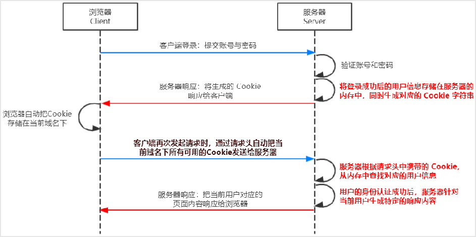

# exercise1

## Web 开发模式

目前主流的 Web 开发模式有两种，分别是：

1. 基于【服务端渲染】的传统 Web 开发模式
2. 基于【前后端分离】的新型 Web 开发模式

### 服务端渲染

服务端渲染的概念：服务器发送给客户端的 HTML 页面，是在服务器通过字符串拼接动态生成的

因此，客户端不需要使用 Ajax 这样的技术额外请求数据（技术上还是支持混用 Ajax 的）

优点：

1. 前端耗时少：因为服务端负责动态生成 HTML 内容，浏览器只需要渲染页面即可；尤其是移动端（更省电）
2. 有利于 SEO：因为服务端响应的是完整的 HTML 内容，所以爬虫更容易爬取获得信息

缺点：

1. 占用服务端资源：因为基本上事情都在服务端完成了，如果请求较多，会对服务器造成一定的访问压力
2. 不利于前后端分离，开发效率低：对于前端复杂度高的项目，不利于分工高效开发

### 前后端分离

前后端分离的概念：前后端分离的开发模式，依赖于 Ajax 技术的广泛应用；该模式后端只负责提供 API 接口，前端使用 Ajax 调用接口获取数据

优点：

1. 开发体验好：前端专注于 UI 开发，后端专注于 API 开发；且前端有更多的选择性
2. 用户体验好：Ajax 技术的广泛应用，极大的提高了用户体验，可以轻松实现页面局部刷新
3. 减轻了服务端的渲染压力：因为页面都是在每个用户的浏览器中渲染的

缺点：

1. 不利于 SEO：因为完整的 HTML 内容需要在客户端动态拼接完成，所以爬虫无法爬取页面的有效信息；解决方案：利用 Vue、React 等框架的 SSR 技术能够很好的解决 SEO 问题

## Session 身份认证机制【适用于服务端渲染开发模式】

### HTTP 协议的无状态性

HTTP 协议的无状态性：客户端的每次 HTTP 请求都是独立的，连续多个请求之间没有直接关系，服务端不会主动保留每次请求的状态

### Cookie

Cookie 是存储在用户浏览器中的一段不超过 4KB 的字符串

它由一个名称、一个值和其它几个用于控制 Cookie 有效期、安全性、使用范围的可选属性组成

Cookie 受同源策略限制【官方说明】，但是在浏览器实际实现时：

不同域名【ip】下的 Cookie 各自独立，每当客户端发起请求时，会【自动】把当前域名下【所有】【未过期】的 Cookie 一同发送到服务端

> 也就是说：实际上，协议不同、端口不同但是域名相同依旧会共享 Cookie

特性：

1. 自动发送
2. 域名独立
3. 过期时限
4. 4KB 限制

#### Cookie 不具有安全性

由于 Cookie 是存储在浏览器中的，而且浏览器也提供了读写 Cookie 的 API，因此 Cookie 很容易被伪造，不具有安全性

因此不建议服务器将重要的隐私数据，通过 Cookie 形式发送给浏览器

### Session 的工作原理

